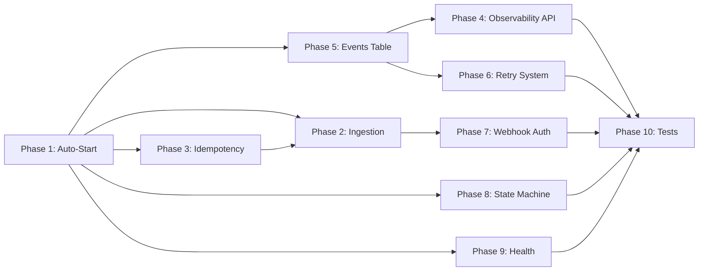

# Implementation Plan: Fully Autonomous Workflow Engine (10 Phases)

Transform the AI Artwork Automation Platform from a manual Swagger-trigger system into a **fully autonomous workflow engine** where uploading an artwork automatically triggers the entire processing and publishing pipeline — no `artwork_id` copy-paste required.

> [!IMPORTANT]
> **Future-Ready**: After this implementation, integrating an external Artwork Website will be a **5-minute task** — just call `POST /api/v1/ingestion/artwork` with a JSON body and an API key.

---

## User Review Required

> [!IMPORTANT]
> **Breaking Change**: Phase 1 makes all artwork uploads automatically trigger the full workflow pipeline. This means **every upload will immediately start AI analysis, reel generation, and publishing** (based on feature flags). If you want a "manual mode" toggle, let me know.

> [!WARNING]
> **Database Migration**: Phase 3 adds `image_hash` and `source_url` columns to the `artworks` table. This requires running `alembic upgrade head` inside the container after deployment.

> [!IMPORTANT]
> **New `.env` Variable Required**: Phase 7 adds `WEBHOOK_API_KEY` — you'll need to set this to a strong random string for the ingestion endpoint to be secured.

---

## Open Questions

> [!IMPORTANT]
> 1. **Auto-trigger scope**: Should the auto-trigger fire on **every** upload, or should there be an optional `auto_process=false` query param on the upload endpoint to skip it?
> 2. **Retry limits**: For Phase 6, how many times should a failed publishing step retry before giving up? (Proposed: 3 retries with exponential backoff.)
> 3. **Event retention**: For Phase 5, should `workflow_events` records be retained forever or pruned after a configurable period?

---

## Proposed Changes

### PHASE 1 — Auto-Start Workflow After Upload

Eliminates the manual `POST /artworks/{id}/process` step. Uploading now creates a `WorkflowRun` and dispatches `execute_workflow.delay()` automatically.

---

#### [MODIFY] [artwork_service.py](file:///c:/Users/Ankit/OneDrive/Desktop/All%20Projects/AIautomation/backend/services/artwork_service.py)

- After `self._repo.create(...)` returns the new artwork, automatically:
  1. Create a `WorkflowRun` record (`status=PENDING`)
  2. Dispatch `execute_workflow.delay(workflow_run_id, artwork_id, "v1")`
  3. Update the `WorkflowRun` with the `celery_task_id`
- Add `_auto_trigger_workflow(artwork: Artwork)` private method to handle this
- The upload response will include `workflow_run_id` and `celery_task_id` so the caller knows processing started

#### [MODIFY] [artwork.py (schemas)](file:///c:/Users/Ankit/OneDrive/Desktop/All%20Projects/AIautomation/backend/schemas/artwork.py)

- Add optional `workflow_run_id: UUID | None` and `celery_task_id: str | None` to `ArtworkResponse` so the upload response shows that auto-processing started

---

### PHASE 2 — Ingestion Service (Webhook Endpoint)

Create `POST /api/v1/ingestion/artwork` — a single endpoint that external systems (future art website) can call to trigger the full pipeline from a URL.

---

#### [NEW] [ingestion.py](file:///c:/Users/Ankit/OneDrive/Desktop/All%20Projects/AIautomation/backend/api/v1/ingestion.py)

```python
@router.post("/artwork", response_model=IngestionResponse, status_code=202)
async def ingest_artwork(
    body: IngestionRequest,   # { title, image_url }
    api_key: str = Depends(verify_webhook_api_key),
) -> IngestionResponse:
```

- Downloads image from `image_url` via `httpx`
- Validates MIME type and file size
- Calls `ArtworkService.upload_artwork()` which auto-triggers workflow (Phase 1)
- Returns `{ artwork_id, workflow_run_id, status: "accepted" }`

#### [NEW] [ingestion.py (schemas)](file:///c:/Users/Ankit/OneDrive/Desktop/All%20Projects/AIautomation/backend/schemas/ingestion.py)

- `IngestionRequest`: `title: str`, `image_url: HttpUrl`, `source: str | None = "webhook"`
- `IngestionResponse`: `artwork_id: UUID`, `workflow_run_id: UUID | None`, `status: str`

#### [MODIFY] [router.py](file:///c:/Users/Ankit/OneDrive/Desktop/All%20Projects/AIautomation/backend/api/router.py)

- Include `ingestion_router` under `/api/v1/ingestion`

---

### PHASE 3 — Idempotency (Duplicate Detection)

Prevent the same image from being processed twice by hashing the file content and checking `source_url`.

---

#### [MODIFY] [artwork.py (model)](file:///c:/Users/Ankit/OneDrive/Desktop/All%20Projects/AIautomation/backend/models/artwork.py)

- Add two new columns:
  - `image_hash: Mapped[str | None]` — SHA-256 of file bytes (indexed, unique)
  - `source_url: Mapped[str | None]` — original URL if ingested via webhook

#### [MODIFY] [artwork_service.py](file:///c:/Users/Ankit/OneDrive/Desktop/All%20Projects/AIautomation/backend/services/artwork_service.py)

- In `upload_artwork()`:
  1. Compute `hashlib.sha256(file_data).hexdigest()`
  2. Check if artwork with this hash already exists
  3. If duplicate found, return existing artwork response (idempotent)
  4. Persist `image_hash` on new artwork record

#### [NEW] Alembic migration

- `alembic/versions/xxxx_add_image_hash_source_url.py`
- Adds `image_hash` (String(64), nullable, unique, indexed) and `source_url` (String(2000), nullable) to `artworks`

---

### PHASE 4 — Observability (Workflow Status API)

Provide a public endpoint to check workflow progress without needing Celery or Flower access.

---

#### [NEW] [workflow.py (API)](file:///c:/Users/Ankit/OneDrive/Desktop/All%20Projects/AIautomation/backend/api/v1/workflow.py)

```python
@router.get("/{workflow_id}", response_model=WorkflowDetailResponse)
async def get_workflow_detail(workflow_id: UUID) -> WorkflowDetailResponse:
    """Get comprehensive workflow status with event timeline."""
```

- Returns: status, current_node, started_at, completed_at, error_history, publishing statuses, events timeline (Phase 5)

#### [MODIFY] [workflow.py (schemas)](file:///c:/Users/Ankit/OneDrive/Desktop/All%20Projects/AIautomation/backend/schemas/workflow.py)

- Add `WorkflowDetailResponse` with full event timeline, duration calculations, and human-readable progress

#### [MODIFY] [router.py](file:///c:/Users/Ankit/OneDrive/Desktop/All%20Projects/AIautomation/backend/api/router.py)

- Include `workflow_router` under `/api/v1/workflows`

---

### PHASE 5 — Workflow Events Table

Track every LangGraph node execution with timing data for audit trail and debugging.

---

#### [NEW] [workflow_event.py (model)](file:///c:/Users/Ankit/OneDrive/Desktop/All%20Projects/AIautomation/backend/models/workflow_event.py)

```python
class WorkflowEvent(UUIDMixin, TimestampMixin, Base):
    __tablename__ = "workflow_events"
    
    workflow_run_id: UUID (FK → workflow_runs.id)
    node_name: str           # "analyze_artwork", "generate_reel", etc.
    event_type: str          # "started", "completed", "failed", "skipped"
    started_at: datetime
    completed_at: datetime | None
    duration_ms: int | None
    error_message: str | None
    metadata: JSON | None    # Node-specific data (e.g., track selected, tokens used)
```

#### [MODIFY] [nodes.py](file:///c:/Users/Ankit/OneDrive/Desktop/All%20Projects/AIautomation/backend/graph/nodes.py)

- Add `_emit_event(workflow_run_id, node_name, event_type, ...)` helper
- Call at the start and end of each node function

#### [NEW] Alembic migration

- `alembic/versions/xxxx_add_workflow_events.py`

---

### PHASE 6 — Retry System

Implement intelligent retry logic for transient publishing failures.

---

#### [MODIFY] [nodes.py](file:///c:/Users/Ankit/OneDrive/Desktop/All%20Projects/AIautomation/backend/graph/nodes.py)

- Wrap `publish_instagram` and `publish_youtube` nodes with retry decorator:
  - Max 3 retries, exponential backoff (5s, 15s, 45s)
  - Only retry on transient errors (network timeouts, rate limits)
  - Non-retryable errors (auth failure, invalid media) fail immediately
- Record each retry attempt as a workflow event (Phase 5)

#### [MODIFY] [workflow_task.py](file:///c:/Users/Ankit/OneDrive/Desktop/All%20Projects/AIautomation/backend/tasks/workflow_task.py)

- Add a `retry_workflow` Celery task that re-runs only the failed publishing nodes
- Called via `POST /api/v1/workflows/{id}/retry` (Phase 4 API)

---

### PHASE 7 — Webhook Authentication

Secure the ingestion endpoint with API key authentication.

---

#### [NEW] [webhook_auth.py](file:///c:/Users/Ankit/OneDrive/Desktop/All%20Projects/AIautomation/backend/auth/webhook_auth.py)

```python
async def verify_webhook_api_key(
    x_api_key: str = Header(..., alias="X-API-KEY"),
) -> str:
    """Verify the webhook API key from X-API-KEY header."""
    settings = get_settings()
    if not hmac.compare_digest(x_api_key, settings.webhook_api_key):
        raise AuthenticationException(detail="Invalid API key")
    return x_api_key
```

#### [MODIFY] [settings.py](file:///c:/Users/Ankit/OneDrive/Desktop/All%20Projects/AIautomation/backend/config/settings.py)

- Add `webhook_api_key: str = ""` to root `Settings`

#### [MODIFY] [.env.example](file:///c:/Users/Ankit/OneDrive/Desktop/All%20Projects/AIautomation/.env.example)

- Add `WEBHOOK_API_KEY=generate-a-strong-random-key`

---

### PHASE 8 — State Machine (Strict Status Transitions)

Enforce strict lifecycle transitions so artwork status can only move forward, never backward.

---

#### [MODIFY] [artwork.py (model)](file:///c:/Users/Ankit/OneDrive/Desktop/All%20Projects/AIautomation/backend/models/artwork.py)

Add a `_VALID_TRANSITIONS` map and a `transition_to(new_status)` method:

```python
_VALID_TRANSITIONS = {
    ArtworkStatus.UPLOADED: {ArtworkStatus.ANALYZING, ArtworkStatus.FAILED},
    ArtworkStatus.ANALYZING: {ArtworkStatus.PROCESSING, ArtworkStatus.FAILED},
    ArtworkStatus.PROCESSING: {ArtworkStatus.PUBLISHING, ArtworkStatus.COMPLETED, ArtworkStatus.FAILED},
    ArtworkStatus.PUBLISHING: {ArtworkStatus.COMPLETED, ArtworkStatus.FAILED},
    ArtworkStatus.COMPLETED: set(),  # terminal
    ArtworkStatus.FAILED: {ArtworkStatus.UPLOADED},  # allow re-processing
}

def transition_to(self, new_status: ArtworkStatus) -> None:
    allowed = _VALID_TRANSITIONS.get(self.status, set())
    if new_status not in allowed:
        raise WorkflowException(
            detail=f"Invalid transition: {self.status.value} → {new_status.value}"
        )
    self.status = new_status
```

#### [MODIFY] [nodes.py](file:///c:/Users/Ankit/OneDrive/Desktop/All%20Projects/AIautomation/backend/graph/nodes.py)

- Replace direct `status = X` assignments with `artwork.transition_to(X)` calls

---

### PHASE 9 — Health Endpoints Enhancement

Add deeper health checks for system monitoring and external integrations.

---

#### [MODIFY] [health.py](file:///c:/Users/Ankit/OneDrive/Desktop/All%20Projects/AIautomation/backend/api/v1/health.py)

- Add `GET /health/workflow` — returns:
  - Total workflows: pending, running, completed, failed (last 24h)
  - Average workflow duration
  - Last workflow completion time
- Add `GET /health/integrations` — returns:
  - Gemini API reachability
  - Groq API reachability
  - Instagram Account 1 (Gallery) reachability & status details
  - Instagram Account 2 (Photography) reachability & status details
  - YouTube API reachability & token check
  - Pinterest API reachability
  - TikTok API reachability

#### [MODIFY] [health.py (schemas)](file:///c:/Users/Ankit/OneDrive/Desktop/All%20Projects/AIautomation/backend/schemas/health.py)

- Define `IntegrationStatus` and `IntegrationsHealthResponse` models to detail integration health.

---

### PHASE 9.5 — Instagram Token Exchange & Refresh Tool

A robust utility script that enables developers to exchange a short-lived Instagram token for a 60-day long-lived access token, refresh an existing long-lived token, verify its scopes/health against the Meta Graph API, and automatically write it back to update the `.env` configuration file.

---

#### [NEW] [refresh_instagram_token.py](file:///c:/Users/Ankit/OneDrive/Desktop/All%20Projects/AIautomation/scripts/refresh_instagram_token.py)

- A standalone Python script that:
  - Loads client configurations (`app_id`, `app_secret`) from environment variables/settings.
  - Prompts for or accepts a new user access token (short-lived).
  - Calls Meta Graph API `oauth/access_token` to exchange/refresh it.
  - Validates the new token against the Instagram Graph API (checks account profile & permissions).
  - In-place updates the corresponding variable (`INSTAGRAM__ACCESS_TOKEN` or `INSTAGRAM_ACC2__ACCESS_TOKEN`) in the `.env` file at the workspace root.

---

### PHASE 10 — Test Suite

Comprehensive tests for all new autonomous features.

---

#### [NEW] [test_auto_trigger.py](file:///c:/Users/Ankit/OneDrive/Desktop/All%20Projects/AIautomation/tests_and_debug/tests/test_auto_trigger.py)

- Test that uploading artwork auto-creates WorkflowRun
- Test that `execute_workflow.delay()` is called with correct args
- Test response includes `workflow_run_id`

#### [NEW] [test_ingestion.py](file:///c:/Users/Ankit/OneDrive/Desktop/All%20Projects/AIautomation/tests_and_debug/tests/test_ingestion.py)

- Test `POST /api/v1/ingestion/artwork` with valid/invalid API key
- Test image download from URL
- Test duplicate detection via `image_hash`

#### [NEW] [test_idempotency.py](file:///c:/Users/Ankit/OneDrive/Desktop/All%20Projects/AIautomation/tests_and_debug/tests/test_idempotency.py)

- Test uploading same image twice returns same artwork
- Test different images get unique hashes

#### [NEW] [test_workflow_events.py](file:///c:/Users/Ankit/OneDrive/Desktop/All%20Projects/AIautomation/tests_and_debug/tests/test_workflow_events.py)

- Test event creation for each node
- Test event timeline ordering

#### [NEW] [test_state_machine.py](file:///c:/Users/Ankit/OneDrive/Desktop/All%20Projects/AIautomation/tests_and_debug/tests/test_state_machine.py)

- Test valid transitions succeed
- Test invalid transitions raise `WorkflowException`

#### [NEW] [test_retry.py](file:///c:/Users/Ankit/OneDrive/Desktop/All%20Projects/AIautomation/tests_and_debug/tests/test_retry.py)

- Test retry logic on transient failures
- Test non-retryable errors fail immediately

---

## Execution Order



**Dependency chain**: P1 → P3 → P2 → P7, and P5 → P4/P6, all converge into P10 (Tests).

---

## Verification Plan

### Automated Tests
```bash
# Run full test suite inside container
docker exec artwork-app pytest tests_and_debug/tests/ -v --tb=short

# Specific phase tests
docker exec artwork-app pytest tests_and_debug/tests/test_auto_trigger.py -v
docker exec artwork-app pytest tests_and_debug/tests/test_ingestion.py -v
docker exec artwork-app pytest tests_and_debug/tests/test_state_machine.py -v
```

### Manual Verification
1. **Phase 1**: Upload image via Swagger → verify `workflow_run_id` in response → verify workflow starts automatically in logs
2. **Phase 2**: `curl -X POST /api/v1/ingestion/artwork -H "X-API-KEY: ..." -d '{"title":"Test","image_url":"..."}'` → verify accepted
3. **Phase 3**: Upload same image twice → verify second returns existing artwork (same `id`)
4. **Phase 4**: `GET /api/v1/workflows/{id}` → verify complete event timeline
5. **Phase 7**: Call ingestion without API key → verify 401 response
6. **Phase 8**: Manually try invalid status transition in DB → verify WorkflowException
7. **Phase 9**: `GET /health/workflow` → verify stats are accurate
8. **Phase 9 Integration Health**: `GET /health/integrations` → verify health status and details for Gemini, Groq, Instagram (Acc 1 and Acc 2), and YouTube.
9. **Phase 9.5 Token Refresh**: Run `python scripts/refresh_instagram_token.py` → verify it updates `.env` file correctly with a valid long-lived token.
